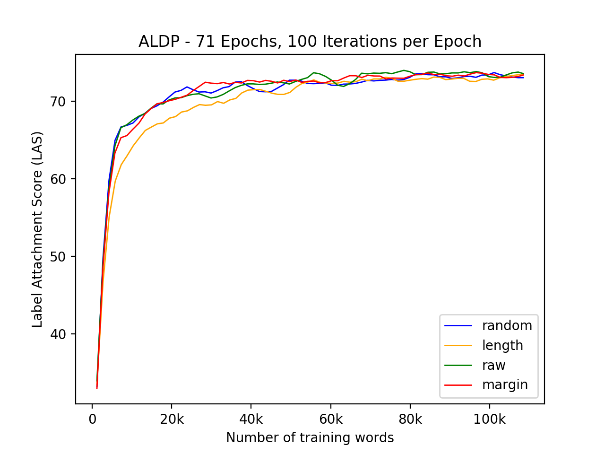
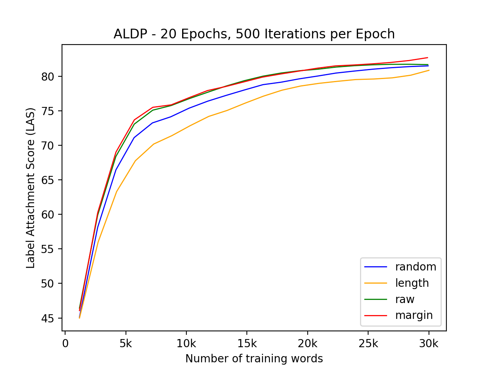

# CS388-NLP-HW3
HW3 of the Natural Language Processing course: Active Learning for Neural Dependency Parsing

## Introduction
Syntactic parsing is an important intermediate stage in most high-level NLP tasks. Neural approaches to dependency parsing have gained popularity in the recent years. However, the construction of a detailed treebank for training these models is a very time consuming process and requires significant domain expertise. In this experiment, we analyse the efficacy of active learning to make these models more data efficient. We compare how different uncertainty sampling techniques, based on the probability of the parser actions, affect the learning curve of the parser on the WSJ dataset. We use the LAS score of the parser to evaluate our experiments.

## Usage

### Creating the dataset

We partition the WSJ data from the Penn Treebank into 3 sets :- seed, training and test set. We don't use the entire dataset for running the active learning simulations.

~~~~
# creating the seed set
cat wsj-conllx/00/* > wsj_00.conllx
# creating the training set
cat `find . -regex './wsj\-conllx\/0[1-3]\/.*'` > wsj_01_03.conllx
# creating the test set
cat wsj-conllx/20/* > wsj_20.conllx
~~~~

### Compiling the code

~~~~
javac -cp .:stanford-corenlp.jar ActiveLearningDependencyParser.java
~~~~

### Arguments

|     Argument    |                                      Summary                                     |
|:---------------:|:--------------------------------------------------------------------------------:|
|    `seedPath`   | path to the seed set                                                             |
|   `trainPath`   | path to the training set                                                         |
|    `testPath`   | path to the test set                                                             |
|  `oraclePolicy` | policy to be used for uncertainty sampling ['random', 'length', 'raw', 'margin'] |
|   `modelPath`   | path where the model is saved                                                    |
|   `statsFile`   | path where the results CSV file is saved                                         |
| `embeddingPath` | path where word embeddings are stored                                            |
|   `tmpDirPath`  | temporary directory location required for the parser (default: `./tmp/`)         |
|  `seedSetSize`  | number of sentences in the seed set (default: 50)                                |
|    `maxIter`    | max number of iterations per epoch (default: 25)                                 |
|  `maxALEpochs`  | max number of active learning epochs (default: 100)                              |
|  `maxNewLabels` | max number of labelled words added in each epoch (default: 1500)                 |

### Training the models

~~~~
java -cp .:stanford-corenlp.jar ActiveLearningDependencyParser \
-mode train \
-seedPath data/wsj_00.conllx \
-trainPath data/wsj_01_03.conllx \
-testPath data/wsj_20.conllx \
-oraclePolicy random \
-modelPath outputs/model_random.model \
-statsFile outputs/stats_random.csv \
-embeddingPath data/en-cw.txt \
-tmpDirPath tmp_random/ \
-seedSetSize 50 \
-maxIter 100 \
-maxALEpochs 100 \
-maxNewLabels 1500
~~~~

### Running on HTCondor

`condor/` contains the Condor scripts used for running these models on the [HTCondor cluster](https://www.cs.utexas.edu/facilities/documentation/condor).

~~~~
pkar@streetpizza:~$ condor_submit condor_random.sh
~~~~

## Results

 

## Conclusions

Our results reinforce the claim that active learning can be used to increase the data efficiency of the Stanford neural dependency parser. With increase in the manually annotated data, the performance in both the experiments increases. Also we see that uncertainty sampling based on margin probability score outperforms other sampling techniques.

